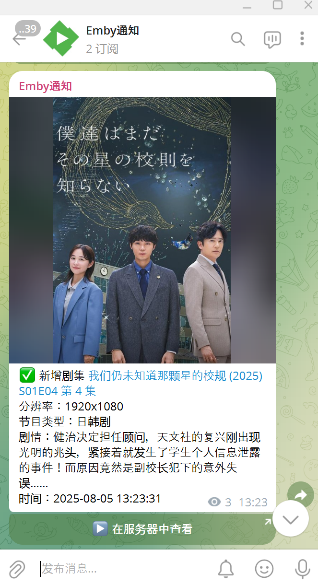
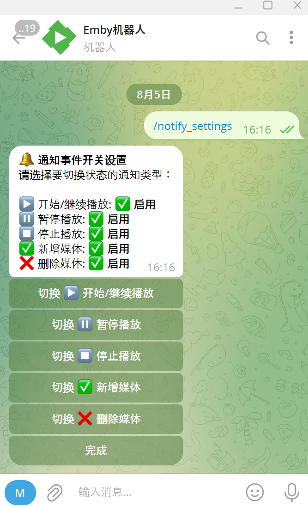

# Emby Telegram Notification Bot

📺 一个为 Emby 媒体服务器打造的高度可定制 Telegram Bot，支持事件通知、互动搜索、播放状态控制和自动消息撤回等功能。使用 Python 编写，支持通过 Docker 快速部署。

---

## ✨ 项目亮点

- 🔔 **实时事件推送**：播放开始/暂停/停止、媒体新增/删除等事件自动推送至 Telegram 群组、频道或私聊
- 🎬 **详细节目信息展示**：支持 TMDB 封面、分辨率、码率、音轨语言、播放进度、设备位置等丰富展示内容
- 🔍 **交互式节目搜索**：支持分页搜索、剧集规格详情查看、更新状态展示、多音轨信息显示
- ✅ **权限控制**：支持群组限制、命令权限判定（仅管理员可执行部分命令）
- ♻️ **自动消息撤回**：除新增节目外的所有命令和通知均支持 60 秒后自动删除
- 📤 **主动控制播放状态**：支持远程终止播放会话、发送/群发 Emby 消息
- 🌐 **语言与地域识别**：音轨语言自动翻译为中文，用户 IP 归属地智能识别

---

## 📦 功能总览

| 类型         | 功能描述 |
|--------------|----------|
| 播放通知     | 自动推送播放开始/暂停/停止事件，展示播放进度与设备详情 |
| 媒体库变动   | 新增/删除媒体自动通知，支持剧集多集入库识别与展示 |
| 播放状态查看 | `/status` 命令查看当前所有 Emby 在线会话，支持远程控制 |
| 节目搜索     | `/search` 支持关键词和年份，展示剧集各季音视频规格、更新进度等 |
| 消息控制     | 用户输入的命令及交互响应自动撤回，保护聊天整洁性 |
| 权限限制     | 仅授权用户/群组可使用，部分操作仅管理员可见 |
| 多语言支持   | 音轨语言自动翻译，展示多音轨与音频布局，精确显示 |

---

## 🚀 快速部署（Docker 推荐）

```bash
docker run -d \
  -v /your/local/config:/config \
  -p 8080:8080 \
  --restart=always \
  xpisce/emby-notifier:latest
```

- `/config/config.yaml`：主配置文件（包含 API Token、Emby 信息等）
- `/config/cache`：缓存目录（封面缓存、语言映射）
- `8080`：Webhook 监听端口（可自定义）

---

## ⚙️ 配置文件说明（config.yaml）

```yaml
telegram:
  token: "123456:ABCDEF"
  chat_id: "-100xxxxxxxx"
  new_library_channel_id: "-100xxxxxxxx"

tmdb:
  api_token: "your_tmdb_token"

proxy:
  http_proxy: "http://127.0.0.1:7890"

emby:
  server_url: "http://192.168.1.100:8096"
  remote_url: "https://emby.yourdomain.com"
  api_key: "emby_api_key"
  user_id: "xxxxxxxx"

settings:
  timezone: "Asia/Shanghai"
  debounce_seconds: 10
  media_base_path: "/media"
  poster_cache_ttl_days: 30
  allowed_group_id: "-100xxxxxxxx"
```

---

## 🔧 可用命令列表（Telegram）

| 命令               | 描述                                      | 权限要求       |
|--------------------|-------------------------------------------|----------------|
| `/search`          | 搜索节目关键词，支持分页展示             | 所有人         |
| `/status`          | 当前 Emby 会话查看与远程控制              | 超级管理员     |
| `/settings`        | 通知展示内容及功能设置菜单               | 超级管理员     |

---

## 📎 使用示例

### 交互式搜索节目：

```
/search 凡人修仙传 2025
```

或输入 `/search` 后，等待提示后回复关键词：

> 请提供您想搜索的节目名称（可选年份）。例如：流浪地球 或 凡人修仙传 2025

---

### 播放通知示例：

```
▶️ 开始播放电影 [流浪地球2 (2023)](https://www.themoviedb.org/movie/...)
用户：张三  
设备：NVIDIA Shield  
位置：广州 广东省 中国移动  
进度：12.5% (00:15:30 / 02:00:00)  
视频规格：HEVC 1920x1080 12.3Mbps HDR  
音频规格：中文 TRUEHD 7.1、英文 DTS 5.1  
时间：2025-08-07 15:01:00
```

---

## 📂 缓存与文件

| 路径 | 说明 |
|------|------|
| `/config/config.yaml` | 主配置文件 |
| `/config/cache/poster_cache.json` | TMDB 封面图缓存 |
| `/config/cache/languages.json` | 音轨语言映射文件（可选） |

---

## 🛠 注意事项

- `emby.user_id` 是必须配置项，否则节目详情和搜索将不可用  
- 请为机器人分配 Telegram 群组 **删除消息权限** 和 **管理消息权限**  
- 若启用了 `allowed_group_id`，机器人只响应该群成员发出的命令  

---

## 🖼️ 截图演示

- **新增节目通知**  
<p align="center"></p>

- **Emby 在线播放状态查看**  
<p align="center"></p>

- **搜索电视剧/电影**  
<p align="center"> </p>

- **交互式设置菜单**  
<p align="center"></p>

---

## 📜 License

MIT License  
本项目仅供学习交流使用，禁止用于商业用途。

---

## 🔗 项目链接

- 📦 GitHub: [https://github.com/xpisce/emby-notifier](https://github.com/xpisce/emby-notifier)  
- 🐳 Docker Hub: [https://hub.docker.com/r/xpisce/emby-notifier](https://hub.docker.com/r/xpisce/emby-notifier)

---

欢迎 Star ⭐ / Fork 🍴，有问题欢迎提 Issue 或 PR 🙌
