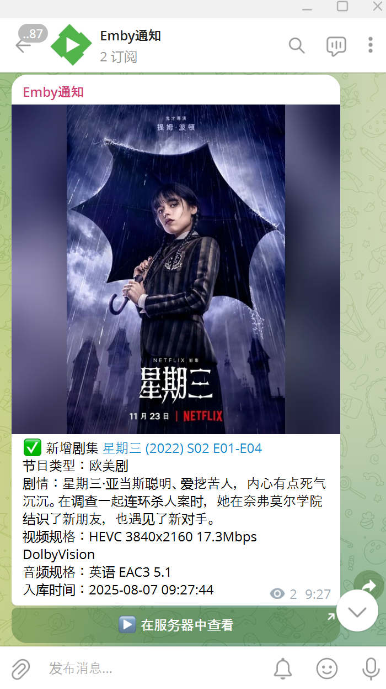
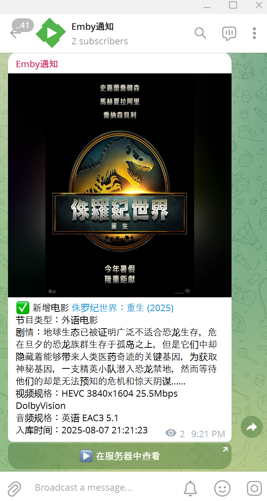
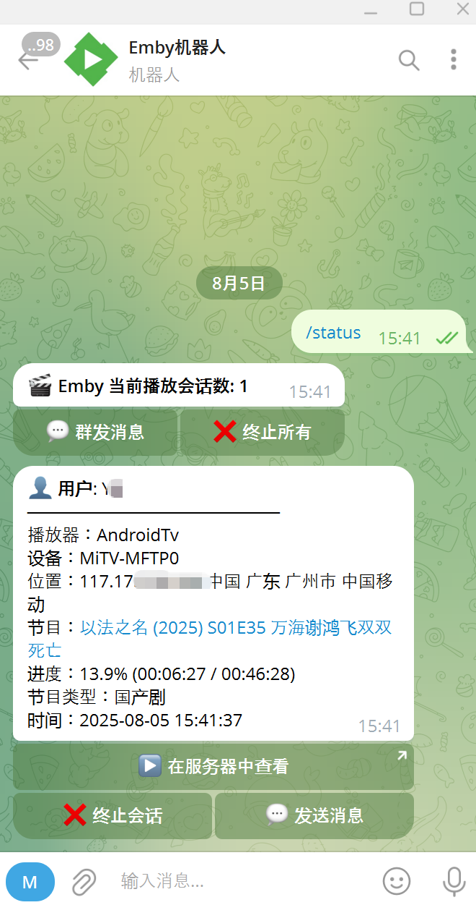
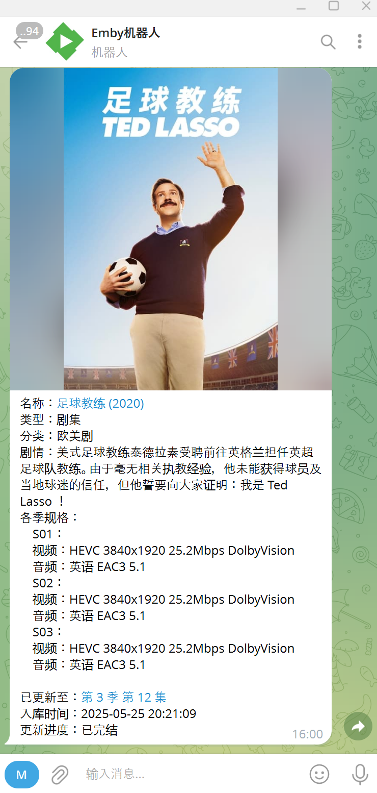
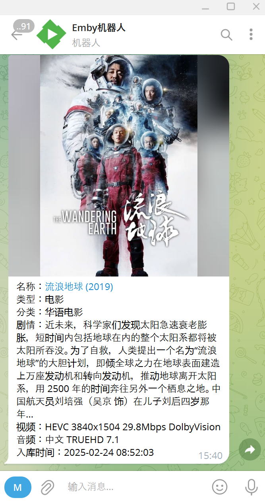
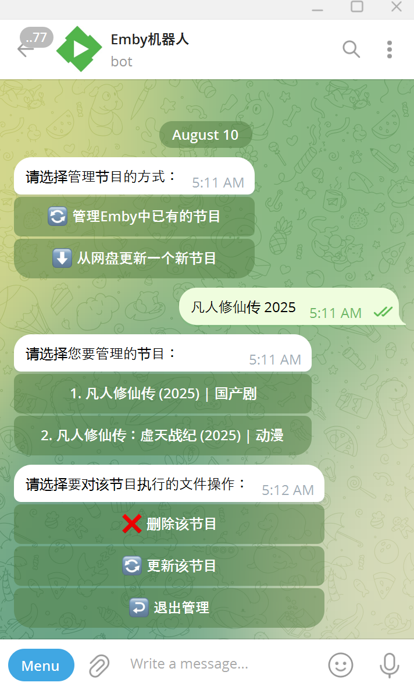
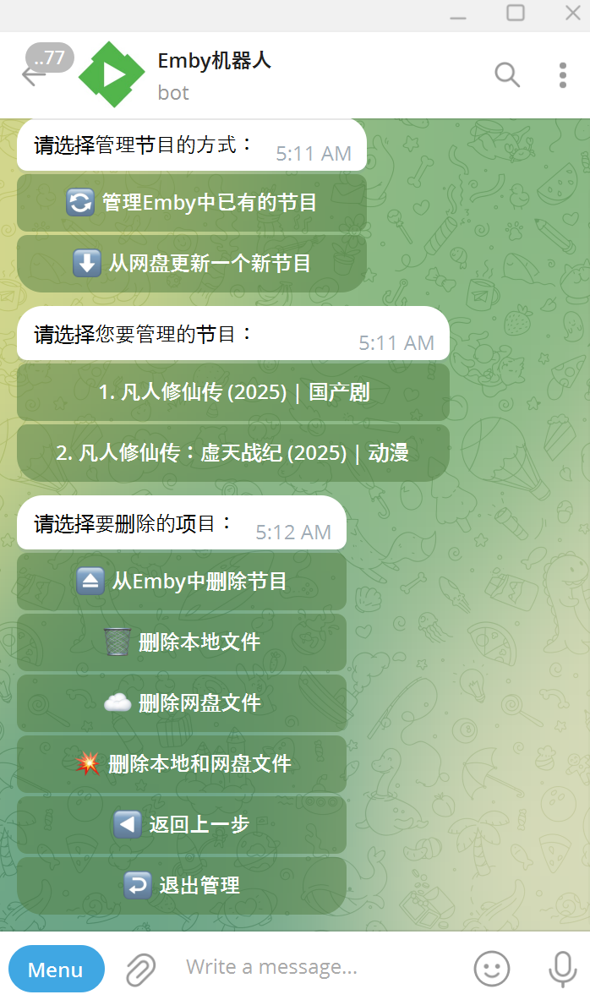
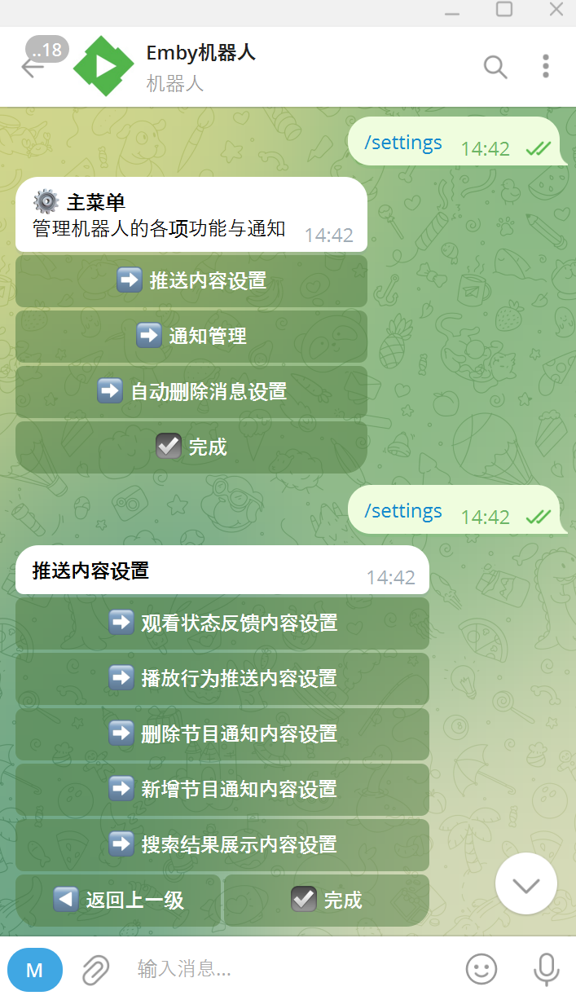
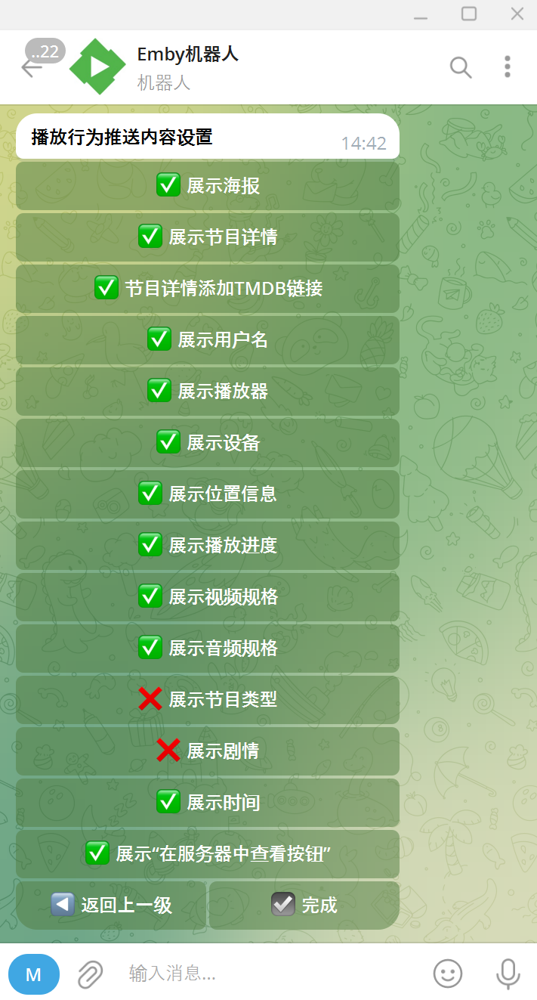

# Emby Telegram Notification Bot

📺 一个为 Emby 服务器的管理员打造的全功能 Telegram Bot，支持媒体事件推送、系统事件告警、交互式搜索、播放状态监控、网盘文件管理、精细化权限与展示设置，并具备自动消息删除功能。适用于家庭服务器、媒体分享群组等多种场景，支持 Docker 快速部署。

### ⚙️ 使用说明

📄 详细使用说明参见：  👉 [User-Guide.md](https://github.com/xpisce/emby-notifier/blob/main/User%20Guide/User-Guide.md)

📄 完整配置文件参见：  👉 [config/config.yaml](https://github.com/xpisce/emby-notifier/blob/main/config/config.yaml)

---

## ✨ 项目亮点

- 🔔 **全方位事件推送**：支持媒体事件（播放、新增、删除）、用户事件（登录成功/失败、用户创建/删除）和系统事件（服务器需重启）的实时通知，便于管理员全面掌握服务器动态。
- 🎬 **内容可视化控制**：通过配置可灵活显示节目封面、标题、TMDB链接、音视频及字幕规格、播放进度等信息。
- 🔍 **智能交互式搜索**：支持关键词分页展示，当直搜无果时会自动通过 TMDB 别名进行后备搜索，并可展示剧集各季码率、音轨、更新进度等。
- 🗃️ **远程文件管理**：支持通过 `/manage` 命令远程更新、入库、删除媒体文件，支持网盘与本地文件操作（视频文件以.strm方式）。
- ✅ **播放状态监控与远程控制**：通过 `/status` 命令可实时查看播放状态，并可终止会话或群发消息。
- 🧩 **权限控制**：可设置机器人仅在指定群组响应，部分命令仅管理员可执行。
- ♻️ **自动消息撤回**：播放通知、搜索响应等均可设置在 60 秒后自动删除，保持聊天清爽。
- 🌐 **多语言与IP识别**：音轨语言自动翻译为中文，IP 地理归属地信息清晰展示。

---

## 📦 功能概览

| 类别 | 功能说明 |
|--------------|----------|
| 播放事件通知 | 支持播放开始、暂停、停止等事件自动推送，可展示播放进度、用户信息、设备、IP归属地等。 |
| 媒体库更新 | 新增/删除节目自动通知，可选展示封面、音视频及字幕规格、剧情简介、入库时间等。 |
| 系统与用户事件 | 支持用户登录成功/失败、用户创建/删除/更新、服务器需要重启等多种关键事件通知，便于管理员监控。 |
| 媒体文件管理 | `/manage` 支持从网盘更新、添加入库、删除 Emby 条目与物理文件（可以精确处理到单/多集/季）。 |
| 播放状态控制 | `/status` 查看所有在线用户，支持发送消息、群发消息、远程终止单人/所有会话。 |
| 节目搜索 | `/search` 支持关键词与智能后备搜索，展示剧集更新进度、音视频及字幕规格、TMDB链接等。 |
| 内容配置 | 通过 `content_settings` 精细控制每类通知的展示内容。 |
| 通知管理 | 通过 `notification_management` 控制哪些事件启用通知，推送到哪类聊天。 |
| 自动撤回 | 可配置哪些类型通知在发送后定时撤回，避免消息冗余。 |
| 权限与安全 | 支持限制机器人只在特定群组响应命令，部分命令仅管理员可用。 |

---

## 🔧 命令说明（Telegram）

| 命令 | 描述 | 权限要求 | 详细使用说明 |
|------------|-----------------------------------------|--------------|--------------|
| `/search` | 搜索节目关键词，支持智能后备搜索，展示剧集更新状态与规格。 | 所有人 | 👉 [/search.md](https://github.com/xpisce/emby-notifier/blob/main/User%20Guide/userguide-search.md) |
| `/status` | 查看当前播放会话，支持远程控制。 | 管理员 | 👉 [/status.md](https://github.com/xpisce/emby-notifier/blob/main/User%20Guide/userguide-status.md) |
| `/settings`| 打开通知展示与开关设置交互菜单。 | 管理员 | 👉 [/settings.md](https://github.com/xpisce/emby-notifier/blob/main/User%20Guide/userguide-settings.md) |
| `/manage` | 管理媒体文件，支持更新、入库、删除等高级操作。 | 管理员 | 👉 [/manage.md](https://github.com/xpisce/emby-notifier/blob/main/User%20Guide/userguide-manage.md) |

---

## 🖼️ 截图演示

- **新增节目通知** 

  
  

- **Emby 在线播放状态查看** 

- **搜索电视剧/电影** 

  
  

- **Emby节目和文件管理** 

  
  

- **交互式设置菜单** 

  
  

---

## ⬆️ 更新计划

| 拟更新内容 | 当前进度 |
|--------------|----------|
| Bug修复与功能优化 | 一直在做 |
| 将每一项功能都撰写详细的使用说明 | 慢慢在做 |
| 节目规格信息中增加字幕信息 | ✅ 已完成（v2.4.3） |
| 字幕规格信息将中文字幕展示在最前面，字幕较多时只展示部分 | 规划中 |
| 给自动删除消息添加自定义时间支持 | 规划中 |
| 给/status命令执行结果增加简要列表样式 |规划中 |
| 为Docker增加内置更新功能 | 规划中 |
| 从网盘更新节目细化到季和集 | 规划中 |
| 增加Emby服务器事件（服务器需重启等）的通知 | ✅ 已完成（v2.4.3） |
| 增加Emby用户事件（创建用户、用户登录、配置用户策略等）的通知 | ✅ 已完成（v2.4.3） |
| 实时监测同一账号的同时播放会话数，超过指定数量时发消息或踢下线 | 规划中 |
| Telegram账号绑定Emby用户并自动配置入群权限、/search命令权限 | 规划中 |
| 给/manage命令增加创建/删除/修改Emby用户的功能 | 规划中 |
| 给/manage命令增加刷新指定Emby媒体库/节目的功能 | 规划中 |
| 给/settings命令增加切换IP地址识别API的功能 | 规划中 |
| Emby用户异地登陆提醒 | 规划中 |
| 添加企业微信支持 | 规划中 |
| 添加英语支持 | 规划中 |
| 暂时没了，等想到了再加。。。 |

---

## 📜 License

MIT License  
本项目仅供学习交流使用，禁止商业用途。

---

## 🔗 项目地址

- 📦 GitHub: [https://github.com/xpisce/emby-notifier](https://github.com/xpisce/emby-notifier)
- 🐳 Docker Hub: [https://hub.docker.com/r/xpisce/emby-notifier](https://hub.docker.com/r/xpisce/emby-notifier)

---

欢迎 Star ⭐ / Fork 🍴，如有问题欢迎提 Issue 或 PR 🙌
